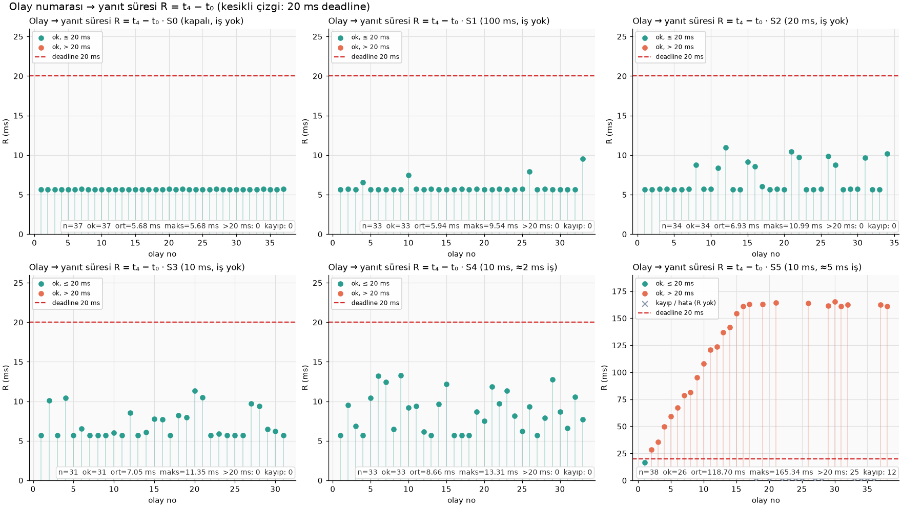
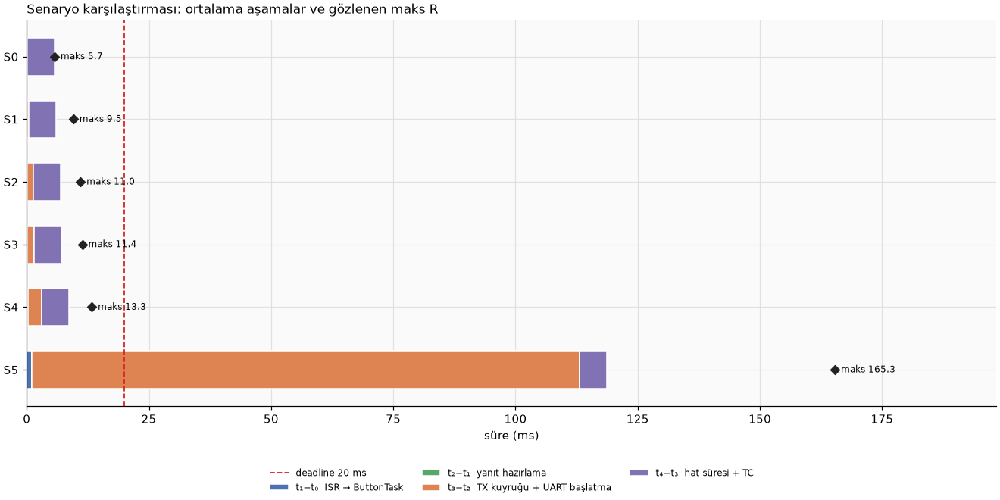

# Analiz Raporu: Yük Altında Buton Yanıt Süresi

> Tablolardaki ve grafiklerdeki bütün sayılar `analysis/analyze.py` betiğinin `measurements/` altındaki ham CSV dosyalarından ürettiği çıktıdır (bkz. [tables.md](tables.md)). Ham CSV'ler elle düzenlenmemiştir.

## 1. Deney Koşulları

- Kart, MCU saati, tick hızı, timer ve derleme ayarları: bkz. [README](../README.md#1-donanım-bağlantılar-ve-araç-sürümleri)
- Ölçülen firmware: `olcum-v2` tag'i (`5baf768`). NUCLEO-L476RG, 80 MHz, FreeRTOS 10.3.1, Debug `-O0`. v2, v1'e TX ve buton kuyruklarının high-water mark sayaçlarını ekler. v1 ölçümleri [measurements/olcum-v1/](../measurements/olcum-v1/) altında arşivlidir ve bu raporda kullanılmamıştır.
- Teslim commit'i: _TBD_
- Ölçüm tarihi: 2026-09-29
- Prosedür: her senaryoda `SCN,Sx` → 5 s ısınma → en az 30 basış (en az 0,5 s aralıklı, düzensiz) → `STOP` → `DUMP`. CSV'ler PC arayüzü tarafından DUMP çıktısından olduğu gibi kaydedildi. Basış aralıkları kartın t₀ damgalarından kontrol edildi: en kısa aralık 0,501 s (S1), 0,5 s'nin altında kalan basış yok. S2'nin ilk ölçümünde 4 basış 0,45 s'ye indiği için senaryo tekrarlandı.
- Ek CPU talebi (şartnamedeki yaklaşık hesap, U ≈ C × f): S4'te 100 Hz × 2 ms ≈ %20, S5'te 100 Hz × 5 ms ≈ %50. Bu hesaplanmış bir taleptir, ölçülmüş toplam CPU kullanımı değildir. Ölçülen iş süreleri S4'te 2002–2063 µs, S5'te 5002–5088 µs.
- UART hattı yalnızca telemetri için %5,6 (S1), %27,8 (S2) ve %55,6 (S3–S5) dolu (64 bayt × 10 bit × f / 115200). BTN mesajları buna eklenir.

## 2. Özet Tablo

Birim: ms. Kaynak: [measurements/summary.csv](../measurements/summary.csv). R istatistikleri yalnızca başarılı (`ok`) olaylar üzerinden hesaplandı. p95 en yakın sıra yöntemiyle alındı, yani gözlenmiş bir örnektir.

| Senaryo | Kabul edilen olay | Başarılı (ok) | R min | R ort | R medyan | R p95 | R maks (gözlenen) | > 20 ms | drop | tx_error | timeout | Kayıt kaybı |
|---|---|---|---|---|---|---|---|---|---|---|---|---|
| S0 | 37 | 37 | 5,678 | 5,679 | 5,679 | 5,683 | 5,683 | 0 | 0 | 0 | 0 | 0 |
| S1 | 33 | 33 | 5,678 | 5,944 | 5,679 | 7,891 | 9,540 | 0 | 0 | 0 | 0 | 0 |
| S2 | 34 | 34 | 5,678 | 6,927 | 5,682 | 10,410 | 10,990 | 0 | 0 | 0 | 0 | 0 |
| S3 | 31 | 31 | 5,678 | 7,052 | 6,046 | 10,509 | 11,351 | 0 | 0 | 0 | 0 | 0 |
| S4 | 33 | 33 | 5,678 | 8,657 | 8,672 | 13,235 | 13,310 | 0 | 0 | 0 | 0 | 0 |
| S5 | 38 | 26 | 16,422 | 118,704 | 139,310 | 164,276 | 165,337 | 25 | 12 | 0 | 0 | 0 |

Kuyruk yüksek su seviyeleri ve gerçek telemetri hızı:

| Senaryo | Gerçek telemetri hızı (Hz) | Periyot min / maks (µs) | TX kuyruğu HWM (/16) | Buton kuyruğu HWM (/8) | Düşürülen TEL |
|---|---|---|---|---|---|
| S0 | kapalı | — | 1 | 1 | 0 |
| S1 | 10,00 | 100000 / 100000 | 1 | 1 | 0 |
| S2 | 50,00 | 20000 / 20000 | 1 | 1 | 0 |
| S3 | 100,00 | 9979 / 10021 | 2 | 1 | 0 |
| S4 | 100,00 | 9996 / 10004 | 2 | 1 | 0 |
| S5 | 99,99 | 9998 / 10004 | **16** | 1 | 12 |

Dışlanan kayıtlar ve nedenleri: S5'te 12 olay (18, 20, 22, 23, 24, 25, 27, 28, 33, 34, 35, 36), durum `tx_drop` (TX kuyruğu dolu). Bu olaylarda t₃ ve t₄ alınmadı, bu yüzden R hesaplanamaz. Zaman istatistiklerinden dışlandılar ama kabul edilen olay sayısında ve `drop` sütununda yer alıyorlar. "Deadline karşılandı" olarak sayılmadılar.

## 3. Aşama Süreleri

Birim: ms, başarılı olayların ortalaması.

| Senaryo | t₁ − t₀ | t₂ − t₁ | t₃ − t₂ | t₄ − t₃ | R |
|---|---|---|---|---|---|
| S0 | 0,025 | 0,037 | 0,058 | 5,559 | 5,679 |
| S1 | 0,025 | 0,038 | 0,322 | 5,559 | 5,944 |
| S2 | 0,026 | 0,038 | 1,304 | 5,559 | 6,927 |
| S3 | 0,029 | 0,038 | 1,426 | 5,559 | 7,052 |
| S4 | 0,277 | 0,038 | 2,783 | 5,559 | 8,657 |
| S5 | 0,984 | 0,038 | 112,123 | 5,559 | 118,704 |

Gözlenen maksimumlar (ms): t₁ − t₀ S3'te 0,114, S4'te 2,073, S5'te 5,033. t₃ − t₂ S1'de 3,911, S2'de 5,365, S3'te 5,641, S4'te 5,641, S5'te 159,713.

`bounce_rejected` bütün senaryolarda 0 çıktı.

## 4. Grafikler

### 4.1 Olay numarası → R (20 ms deadline çizgisiyle)

### 4.2 Senaryo → aşama ortalamaları (yığılmış)

Grafik üretme kodu: [analysis/analyze.py](analyze.py). Çizim fonksiyonları PC arayüzüyle ortak: [interface/plots.py](../interface/plots.py).

## 5. Bulgular

> Not: 5. ve 6. bölümler Claude ile birlikte yazıldı (bkz. [ai-usage.md](../docs/ai-usage.md)). Sayıların hepsi bölüm 2–3'teki betik çıktısından alındı.

### 5.1 Telemetri frekansının etkisi (S0 → S1 → S2 → S3)

Ölçüme başlamadan önceki beklentimiz, telemetri sıklaştıkça BTN yanıtının TEL mesajlarının arkasında kalacağı ve bu yüzden t₃ − t₂'nin uzayacağıydı. İlk dört senaryo bu beklentiyle örtüştü ve değişim neredeyse yalnızca o aşamada kaldı. t₃ − t₂ ortalaması S0'da 0,058 ms iken S1'de 0,322, S2'de 1,304, S3'te 1,426 ms oldu. Aynı sürede t₂ − t₁ 0,037–0,038 ms'de, hat süresi t₄ − t₃ ise 5,559 ms'de hiç kıpırdamadı.

t₃ − t₂'yi yalnızca "kuyrukta bekleme" diye okumak eksik olur. Bu aralık t₂'den, yani `xQueueSend` çağrısından **önce** başlıyor. Kuyruk API'sinin kendi süresini, UartTxTask'a geçişi (scheduling), mesajın tampona kopyalanmasını ve UART'ın başlatılmasını da içeriyor. S0'daki 0,058 ms bu sabit maliyet. Telemetrinin eklediği asıl kısım, BTN'nin o sırada hatta olan TEL mesajının bitmesini beklemesi. Bu bekleme her basışta olmuyor: basış anında hat boşsa hiç beklenmiyor. t₃ − t₂'nin 1 ms'yi aştığı olay sayısı S1'de 3/33, S2'de 11/34, S3'te 11/31. Hat doluluğu ise %5,6, %27,8 ve %55,6. S1 ve S2'deki oranlar hat doluluğuna yakın, S3'te beklenenden az bekleme gördük. 31 basışla bunun rastlantı mı yoksa gerçek bir etki mi olduğunu söyleyemiyoruz. Tek bir beklemenin üst sınırı bir mesaj süresi (≈ 5,6 ms). Gözlenen en uzun beklemeler (3,911 / 5,365 / 5,641 ms) bu sınırın altında kaldı. Kuyruk sayaçları da aynı tabloyu doğruluyor: S0–S2'de TX kuyruğunda aynı anda en fazla 1 mesaj, S3'te en fazla 2 mesaj bulundu.

S3'te küçük bir yan etki de gördük: CPU işi olmadığı halde t₁ − t₀ maksimumu 0,114 ms'ye çıktı. Buton, TelemetryTask kendi TEL mesajını hazırlarken basılırsa ButtonTask o kısa işin bitmesini bekliyor.

Sonuç olarak telemetri tek başına sistemi deadline'a yaklaştırmadı. S0–S3'teki en kötü gözlem 11,351 ms (S3) oldu ve bütün olaylar 20 ms'nin altında kaldı.

### 5.2 CPU yükünün etkisi (S3 → S4 → S5)

CPU yükünde beklentimiz farklıydı. TelemetryTask öncelik 3'te 2 ya da 5 ms hesap yaparken ButtonTask'ın (öncelik 2) CPU'yu bekleyeceğini ve asıl t₁ − t₀'ın büyüyeceğini düşünüyorduk. Bu gerçekten oldu, ama beklediğimiz ölçekte kaldı: t₁ − t₀ ortalaması 0,029 → 0,277 → 0,984 ms'ye çıktı. En kötü değerler (2,073 ve 5,033 ms), iş süresinin kendisi (en fazla 2,063 ve 5,088 ms) artı ISR ve bağlam geçişinin ≈ 25 µs'si kadar. Basış işin ortasına denk gelirse ButtonTask işin bitmesini bekliyor, denk gelmezse hiç beklemiyor.

Asıl sürpriz yine t₃ − t₂'deydi. S4'te ortalaması 2,783 ms ile S3'ün biraz üstünde kaldı ve TX kuyruğu en fazla 2 mesaja ulaştı. S5'te ise t₃ − t₂ 112,123 ms'ye fırladı ve **kuyruk 16 mesajla tamamen doldu.** S5'in grafiği (4.1) diğerlerinden tamamen farklı görünüyor: R ilk basışta 16,4 ms, sonra her basışta yaklaşık 10 ms artıyor ve kuyruk dolduktan sonra ≈ 162 ms'de sabitleniyor (olay ≥ 15 için R ort 161,978 ms). 26 başarılı olayın 25'i deadline'ı kaçırdı. 12 BTN yanıtı ise hiç gönderilemedi (`tx_drop`). Kart aynı senaryoda 12 TEL mesajını da düşürdü.

Bu davranışı ilk olarak kuru denemede gördük ve nedenini ölçümden önce çözmeye çalıştık. S5'te her 10 ms'lik periyodun ilk ≈ 5 ms'sinde TelemetryTask hesap yapıyor. UartTxTask en düşük öncelikte olduğu için, bir mesajın gönderimi bu sırada biterse sıradaki mesaja ancak hesap bittikten sonra başlayabiliyor. Bu arada UART hattı boşta bekliyor. Sonuçta hat periyot başına yalnızca bir mesaj gönderebiliyor. Telemetri de periyot başına tam bir mesaj ürettiği için kuyrukta boşalacak yer kalmıyor ve her BTN mesajı kalıcı bir fazlalık olarak birikiyor. Kuyruk 16 mesaj dolunca (16 × 10 ms ≈ 160 ms) plato oluşuyor ve bundan sonra gelen mesajlar düşürülüyor.

Bu açıklamayı destekleyen iki doğrudan kanıt var. Birincisi kuyruk sayacı: S5'te TX kuyruğunun doluluğu 16/16'ya ulaştı, diğer bütün senaryolarda 2'yi geçmedi. İkincisi t₃'lerin zamanlaması: S5'teki 26 başarılı olayın hepsinde t₃, 10 ms'lik periyodun aynı 6 µs'lik dilimine düşüyor (TIM2 sayacına göre 185–191 µs; bandın konumu timer ile tick arasındaki keyfi faz farkına bağlı, önemli olan genişliği). Yani UART gönderimi her seferinde hesabın bittiği anda başlıyor. Aynı bant S3'te periyodun neredeyse tamamına yayılıyordu (238–9829 µs), S4'te ≈ 2,2 ms'ye (7744–9980 µs) daraldı. Yük arttıkça UartTxTask'ın çalışabildiği zaman aralığı gözle görülür şekilde daralıyor.

## 6. Değerlendirme

Bu ölçümden çıkardığımız en önemli sonuç, gecikmenin beklediğimiz yerde değil, bir aşama sonra birikmesiydi. CPU yükü eklediğimizde t₁ − t₀'ın büyümesini bekliyorduk ve büyüdü. Ama bu artış iş süresiyle sınırlı kaldı, en fazla ≈ 5 ms. Sistemi deadline'ın çok ötesine taşıyan şey, yanıtın TX kuyruğunda ve UART'a erişimde geçen t₃ − t₂ oldu. t₂ − t₁ ve hat süresi t₄ − t₃ hiçbir senaryoda değişmedi. Bu da yanıt hazırlamanın ve fiziksel iletimin sorun olmadığını gösteriyor. Buton tarafında da bir kayıp yaşanmadı: buton kuyruğu hiçbir senaryoda 1'in üstüne çıkmadı ve bütün basışlar kaydedildi. S5'teki kayıplar basışların değil, onlara verilen yanıtların kaybı.

Bunun iki nedeni var ve ikisi birlikte etkili oluyor. Birincisi, BTN yanıtı ile TEL mesajları aynı FIFO kuyrukta, aralarında hiçbir öncelik farkı olmadan sıraya giriyor. Butona basan kullanıcının yanıtı, kuyrukta onun önünde bekleyen telemetri kadar gecikiyor. İkincisi, UART'ın tek sahibi en düşük öncelikli görev. Hattın kapasitesi aslında yeterliydi: S5'te bile doluluk %55,6 idi. Ama UartTxTask CPU'yu alamadığı sürece hat boş bekliyor. Kısacası darboğaz UART'ın kendisi değil, UART'ı süren görevin önceliği.

Bu yorumu dört ölçüme dayandırıyoruz: bölüm 3'teki aşama tablosu, S5'te TX kuyruğunun 16/16 dolması (diğer senaryolarda en fazla 2), S5'te t₃'lerin 6 µs'lik tek bir faz bandında toplanması ve S5 platosunun kuyruk uzunluğu × periyot hesabıyla (≈ 160 ms) örtüşmesi.

Bilmediğimiz şeyler de var. En başta, olası düzeltmelerin hiçbirini denemedik. Görev önceliklerinin şartnamede sabit olması nedeniyle bunlar ancak öneri olarak kalıyor:
- UartTxTask'ın önceliğini yükseltmek, TC gelir gelmez sıradaki gönderimin başlamasını sağlar ve hat boşta beklemez. Birikimin büyük ölçüde erimesini bekliyoruz.
- BTN yanıtları için öncelikli bir kuyruk ya da `xQueueSendToFront`, yanıtı telemetrinin önüne geçirir. Ama telemetri birikimini çözmez ve FIFO şartıyla çelişir.
- DMA tek başına çözüm değil. Her mesajı yine UartTxTask başlatıyorsa aynı bekleme yaşanır. DMA ancak bir sonraki aktarım TC kesmesinin içinden zincirlenirse ya da birikmiş mesajlar tek aktarımda gönderilirse işe yarar, çünkü o zaman gönderim görev önceliğine bağlı olmaktan çıkar.
- Kuyruk dolmaya başladığında TEL mesajlarını bilinçli olarak atlamak, BTN kaybını önler ama telemetri kaybını kabul eder.

Hangisinin ne kadar iyileştireceğini ancak yeni bir ölçüm gösterebilir. Ayrıca S5'teki ortalama ve medyan, senaryonun sabit bir özelliği değil: sistem doyuma ulaştıktan sonra R, kaç kez basıldığına bağlı. Daha uzun bir ölçüm farklı bir ortalama verirdi. Bu yüzden S5 için ortalamadan çok platoyu ve kayıp oranını anlamlı buluyoruz. Son olarak ölçümler Debug (`-O0`) derlemesiyle alındı. Optimizasyonlu bir derlemede yazılım aşamaları kısalır, ama S5'teki birikim mekanizmasının değişmeyeceğini düşünüyoruz, çünkü o mekanizma kodun hızından değil görev önceliklerinden kaynaklanıyor.

## 7. Ölçümün Sınırları

- Gözlenen maksimum, kanıtlanmış worst-case değildir. Her senaryoda 31–38 olay ölçüldü.
- t₀, fiziksel basış anı değil, filtrenin kabul ettiği kenarın ISR giriş zamanıdır. Buton hattındaki donanım gecikmesi (varsa RC filtre) t₀'dan önce kalır ve R'ye dahil değildir.
- t₃, ilk fiziksel bitin çıktığı an değildir. t₄ kesme gözlem gecikmesini içerir. t₄ − t₃ ile teorik hat süresi (5,556 ms) arasındaki ≈ 3 µs fark bu ek süreleri gösterir.
- **Bütün aralıklar duvar saati (wall-clock) süreleridir, CPU süresi değildir.** Örneğin t₂ − t₁'in 0,038 ms çıkması, ButtonTask'ın 38 µs CPU kullandığı anlamına gelmez. Arada gelen kesmeler (TC, tick) ve yüksek öncelikli görevlerin çalışma süresi de bu aralığa eklenir. Aynı şey CPU işinin kalibrasyonu ve ölçülen iş süresi için de geçerlidir: 5002–5088 µs'lik fark, iş sırasında gelen kesmelerin süresini içerir. Kalibrasyonda bu etkiyi azaltmak için 5 ölçümün en kısası alındı.
- Kayıp yanıtlar "deadline karşılandı" olarak sayılmamıştır.
- Kuyruk high-water mark değerleri üretici tarafında, her gönderimden hemen sonra okundu. Başarısız gönderim, kuyruğun o anda dolu (16) olduğunu gösterir.
- Firmware Debug (`-O0`) yapılandırmasıyla derlendi. Yazılım aşamalarının mutlak süreleri optimizasyonlu derlemede farklı olur.
- S5 ortalamaları doyum rejiminde basış sayısına bağlıdır (bkz. bölüm 6).
- Basış aralıkları elle üretildi. En kısa aralık kartın t₀ damgalarından kontrol edildi (≥ 0,501 s), ama aralıkların "düzensizliği" nicel olarak ölçülmedi.
- `bounce_rejected = 0`: test edilen basışlarda filtreye takılan kenar gözlenmedi. Bu, kartın buton devresi hakkında bir iddia değildir.
